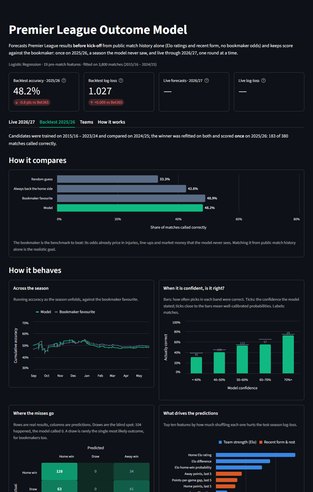

[](https://alemoscardo-ml-football-predictions-streamlit-app-vkbxgd.streamlit.app/)
[](https://github.com/alemoscardo/ml-football-predictions/actions/workflows/tests.yml)
[](https://github.com/alemoscardo/ml-football-predictions/actions/workflows/forecast.yml)

# Premier League Outcome Model

Forecasts English Premier League results (home win / draw / away win) **before kick-off**,
using only information available at the time, and measures the forecasts against the
bookmaker on a season the model never saw.



## Results

Test season **2025/26** (380 matches), scored once after model selection on 2024/25:

| Approach | Accuracy | Log-loss |
|---|---:|---:|
| Random guess | 33.3% | 1.099 |
| Always back the home side | 42.6% | — |
| **Bookmaker favourite (Bet365)** | **48.9%** | **1.019** |
| **Model: Elo + recent form (logistic regression)** | **48.2%** | **1.027** |

Built only from public match history, with no odds as inputs, the model gets within 0.01
log-loss of the bookmaker, whose odds also price in line-ups, injuries and market money.

## Live forward test

A backtest can always hide a subtle leak; a forecast published before the match cannot. Since
October 2026 the model forecasts every 2026/27 match before kick-off, in public:

- A scheduled GitHub Actions job ([`forecast.yml`](.github/workflows/forecast.yml)) runs
  `forecast.py` every four hours: it refreshes this season's results and the upcoming fixtures,
  builds pre-match features from every result so far, and forecasts each fixture that has not
  kicked off.
- Forecasts go to [`predictions/live.csv`](predictions/live.csv), an **append-only ledger**:
  one row per match with the kick-off, the time it was logged, a model version hash, the
  model's probabilities and the bookmaker's at that moment. Rows are appended, never rewritten,
  and the workflow fails if a logged row changes.
- Each run that adds rows is a commit by `github-actions[bot]`, so the
  [commit history](https://github.com/alemoscardo/ml-football-predictions/commits/main/predictions/live.csv)
  and the workflow logs timestamp every forecast.
- The model is **frozen for the season**: the spec chosen on 2024/25, refitted once on every
  completed season. Only its inputs move as results come in.

The app scores the ledger against final results as the season goes, next to the bookmaker.

## How it works

**Features** (`feature_engineering.py`), each computed only from matches played before the one
being predicted:
- **Elo ratings** updated after every result (goal-margin weighted, home advantage, 20% pull
  towards the mean between seasons, clubs new to the data start below average)
- **Recent form**: points, goals scored and conceded, shots on target for and against over each
  side's last 5 league matches, plus the home-minus-away gaps
- **Rest days** since each side's previous match

Bet365 odds are never model inputs: they are converted to margin-free probabilities and used
only as the benchmark.

**Validation** (`train_models.py`) is strictly chronological:

| Seasons | Role |
|---|---|
| 2014/15 | Burn-in: warms up Elo and form, never trained on |
| 2015/16 – 2023/24 | Training |
| 2024/25 | Validation: picks algorithm and hyper-parameters by log-loss |
| 2025/26 | Test: scored once at the end |

Candidates are logistic regression (several regularisation strengths) and extra trees (depth and
leaf-size grid). The winner is refitted on train + validation before the test season is scored.
Every trial is saved to `models/model_metrics.json` and shown in the app.

## The app

Headline KPIs for the backtest and the live record, each against the bookmaker, then four tabs
(each one linkable, e.g. `?tab=teams`):

- **Live**: the next matches as the model's home/draw/away split next to Bet365's, then the
  settled forecasts with a running accuracy against the bookmaker favourite
- **Backtest**: the model next to random guessing, always backing the home side and the
  bookmaker favourite; running accuracy, calibration, confusion matrix and permutation feature
  importance; every match in a filterable table, exportable to CSV
- **Teams**: current Elo ranking, and any club's rating after every match since 2014/15
- **How it works**: validation design, the live pipeline, limitations and the full
  model-selection table

Models are refitted in-process at startup from the saved spec, so the app never depends on the
scikit-learn version that wrote a pickle.

## Notebook

[`notebooks/01_data_exploration.ipynb`](notebooks/01_data_exploration.ipynb): outcome shares per
season, Elo sanity check, a leakage test that recomputes rolling form by hand, and a calibration
plot of model vs. bookmaker.

## Tests

`tests/test_features.py` guards against look-ahead leakage: it tampers with one match's result
and checks that neither that match's features nor any earlier ones change, and recomputes rolling
form by hand. `tests/test_forecast.py` covers the live ledger: only matches not yet started are
logged, logged rows are never rewritten, and an unplayed fixture adds no form or Elo change to the
next one. GitHub Actions runs `ruff`, the tests and the full training pipeline on every push.

## Limitations

- No line-ups, injuries or expected-goals data, which is where bookmakers get their edge
- Draws are almost never the single most likely outcome, so they are rarely predicted
- Clubs promoted after years away keep their old Elo, pulled towards the league average
  (Hull start 2026/27 at 1485, above several established sides). Starting every promoted club
  at the newcomer rating instead was tested and did not improve validation log-loss
- One test season is 380 matches: differences of a point or two in accuracy are within noise

## Run locally

```bash
pip install -r requirements.txt
python fetch_data.py        # download season CSVs from Football-Data.co.uk into data/
python train_models.py      # tune on 2024/25, score 2025/26, write models/model_metrics.json
python forecast.py          # forecast upcoming fixtures, append to predictions/live.csv
streamlit run streamlit_app.py

pip install -r requirements-dev.txt && ruff check . && pytest   # lint + tests
```

When a season ends, move its file from `data/live/` to `data/` and rerun `train_models.py`:
the finished season becomes the new test season and the next one starts a fresh live record.

## Data

[Football-Data.co.uk](https://www.football-data.co.uk/englandm.php): results, match statistics
and pre-match odds for every Premier League match.

## License

[MIT](LICENSE). Match data belongs to Football-Data.co.uk.
